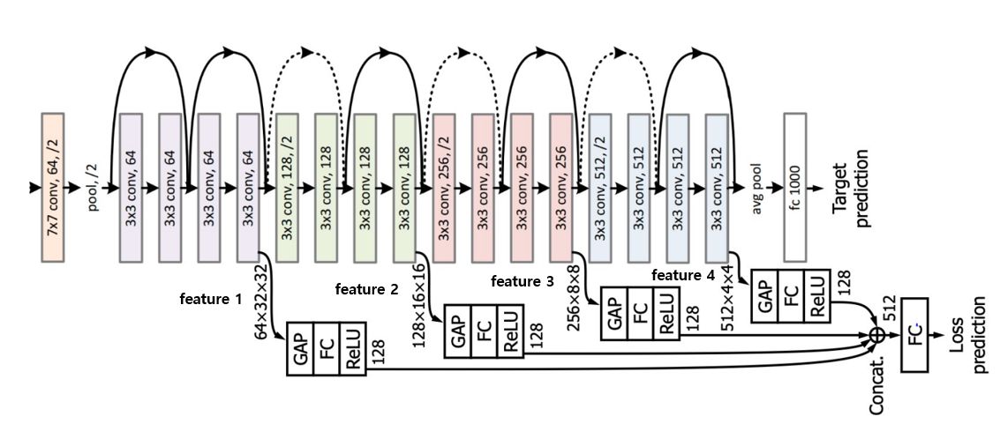
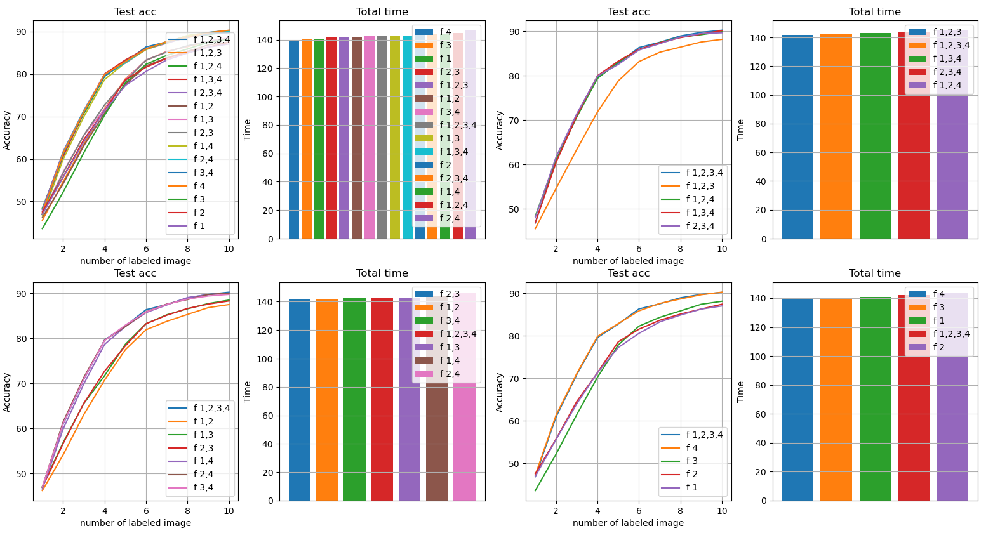

# Learning loss for active learning add experiments
Paper's code of learning loss for active learning and additional experiments performed

## Paper
https://arxiv.org/pdf/1905.03677.pdf

<br/>

## Application technology
```
Python  
CNN
Active learning
Pytorch  
```

<br/>

## Additional experimental Result

 
Detail of experiments

<br/>
<br/>

 
Additioal experimental results

